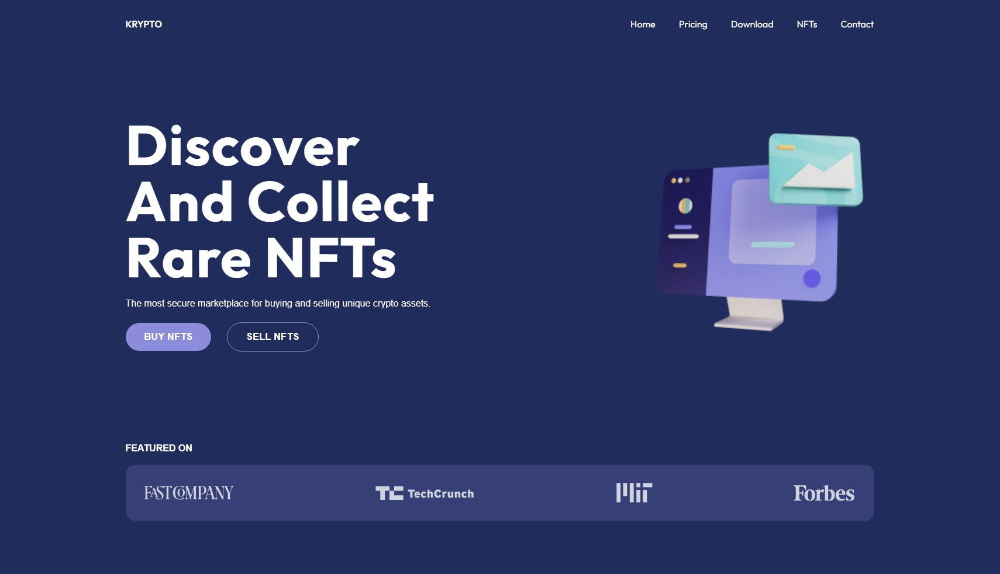

# [Krypto](https://krypto-website.netlify.app/) - A Modern UI/UX Website

This website is designed with [Figma](https://www.figma.com/) and built with [React](https://reactjs.org/) and [Tailwind CSS](https://tailwindcss.com/) by Suman Sourabh.

## Motivation

I wanted to build this project to showcase my skills around designing a website in Figma from scratch and then converting it into a coded website.

## Tech Used

### Code Editor Used

## About

This website makes use of React and JavaScript ES6 fundamental concepts such as

- Components
- Props
- State
- Import/Export

## Features

- Responsiveness
- Background color gradients

## Screenshots

## Helpful Links

- [Live website](https://krypto-website.netlify.app/)
- [Figma design](https://www.figma.com/file/TduSS7r7Fit8FnArBDmCdg/Krypto-Website-Design-v1---Figma?node-id=0%3A1)
- [Angry Tools](https://angrytools.com/gradient/) - For making color gradients

Built by [Suman Sourabh](https://sumansourabh.netlify.app/) - 2022